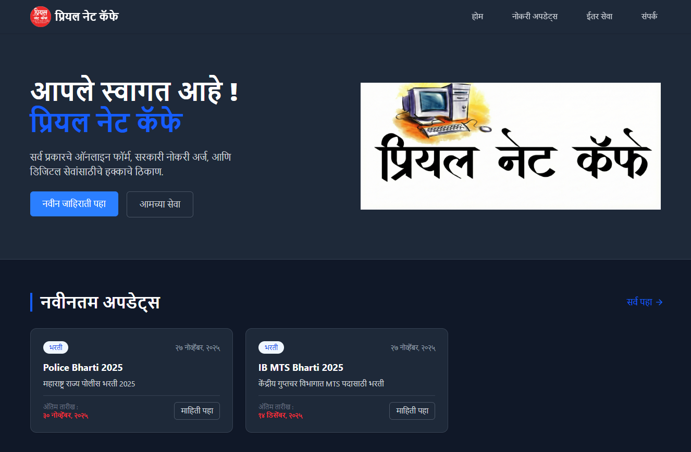

# Priyal Net Cafe - Digital Services Portal

 🔗 **Live Website:** https://priyal-net-cafe.vercel.app



## 📋 Overview

**Priyal Net Cafe** is a full-stack web application designed for a local internet cafe business in Islampur, Maharashtra. The platform serves as a digital notice board and service catalog.

It allows the business owner to post updates about **Government Job Vacancies (Bharti)**, **Exam Results**, and **Online Forms**, while also listing available digital services (like Shop Act, Pan Card, etc.) with their fees and required documents. The application features a robust Admin Dashboard for content management and analytics.

## 🚀 Features

### 🌍 Public User Interface
* **Latest Updates:** Browse the latest government job postings and exam results.
* **Advanced Search & Filter:** Filter posts by category (Recruitment, Online Form, Exam, Result) or search by keywords.
* **Archives:** View expired or past job postings separately.
* **Service Catalog:** View list of services, processing time, fees, and required documents.
* **Direct Interaction:** "Apply via WhatsApp" and "Call Now" buttons for immediate inquiry.
* **Responsive Design:** Fully optimized for mobile and desktop viewing.

### 🛡️ Admin Dashboard
* **Analytics:** View total visits, post views, and top-performing posts.
* **Post Management:** Create, Edit, and Delete job postings.
    * Rich editor for Seat Details (Vacancy matrix).
    * Tag-based inputs for Fees, Age Limit, and Qualifications.
* **Service Management:** Add or update services with fee structures and document lists.
* **Auto-Expiry:** Automated Cron jobs deactivate posts automatically after their last date.
* **Secure Authentication:** JWT-based login system with Access and Refresh tokens.

## 🛠️ Tech Stack

### Frontend
* **Framework:** React.js (Vite)
* **Styling:** Tailwind CSS
* **Routing:** React Router DOM
* **Icons:** Lucide React
* **HTTP Client:** Axios (with Interceptors)
* **State/Data:** React Hooks

### Backend
* **Runtime:** Node.js
* **Framework:** Express.js
* **Database:** MongoDB (Mongoose)
* **Authentication:** JWT (JSON Web Tokens) & Bcrypt
* **Scheduling:** Node-Cron (for daily cleanups)
* **File Handling:** Standard JSON/Middleware

## 📂 Project Structure

```bash
priyal_net_cafe/
├── backend/                # Node.js & Express Server
│   ├── src/
│   │   ├── controllers/    # Route logic
│   │   ├── models/         # Mongoose Schemas
│   │   ├── routes/         # API Endpoints
│   │   ├── middlewares/    # Auth & Analytics
│   │   └── jobs/           # Cron jobs
│   └── ...
├── frontend/               # React Client
│   ├── src/
│   │   ├── components/     # Reusable UI (Button, Card, etc.)
│   │   ├── features/       # Admin, Auth, Posts, Services modules
│   │   ├── pages/          # Public pages
│   │   └── lib/            # Axios setup
│   └── ...
└── README.md
```

## 🔐 Admin Access

To access the admin dashboard:

1. Go to `/login` route.
2. Use the Admin credentials (you must register an admin via the backend API or seed script first as the register route is open in the code provided).

## 🕒 Automation

* **Cron Job:** The system runs a check every night at midnight (`0 0 0 * * *`) to find posts where the `lastDate` has passed and sets their status to `Inactive`.

## 🤝 Contact & Support
* **Owner:** Satish Kadam.
* **Business:** Priyal Net Cafe, Islampur.

## 👨‍💻 Made with ❤️ by **Vivek** 
